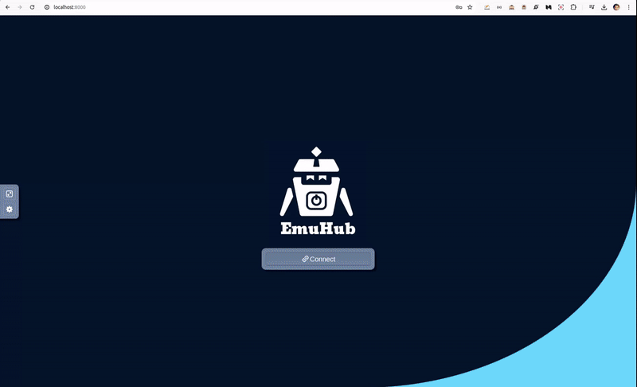

# EmuHub


<p align="center">
  
</p>

## Overview
EmuHub is an innovative tool designed to simplify the testing of Android applications by providing access to multiple emulators via web browsers. Built with Docker and NoVNC (HTML5-based VNC client), EmuHub offers developers and QA engineers a seamless platform for testing APKs across various Android device configurations.

## Features
- **Multiple Emulators**: EmuHub allows you to access multiple Android emulators simultaneously, facilitating parallel testing of applications.
- **Web-Based Interface**: With EmuHub, you can control and interact with emulators directly from your web browser, eliminating the need for local installations or complex configurations.
- **Dockerized Environment**: EmuHub is built using Docker containers, ensuring easy deployment and scalability across different environments.
- **Customizable Configurations**: EmuHub is based on images from [mohamed-helmy/android-docker](https://github.com/mohamed-helmy/android-docker), providing flexibility to customize emulator configurations according to your testing requirements.
- **Seamless Testing Experience**: EmuHub simplifies the testing process by offering a user-friendly interface and centralized access to emulator instances, enhancing productivity for developers and QA engineers.
### Supported Tags
- `docker pull mohamedhelmy/emuhub:latest`

## Getting Started
To use EmuHub, follow these steps:

1. **Clone the Repository**: Clone the EmuHub repository to your local machine.

    ```bash
    git clone git@github.com:mohamed-helmy/emuhub.git
    ```

2. **Build the Docker Image**
    ```bash
    docker build -t emuhub .
    ```

3. **Run EmuHub Container**: 

  Start the EmuHub container.

    ```bash
    docker run -d \
    --name emulator \
    --privileged \
    -e VNCPASS=admin \
    -e emuhubPASS=admin \
    -e LISTENPORT=8000 \
    -p 8000:8000 \
    -v $(pwd)/apk-demo:/home/emuhub/apk \
    --log-driver=json-file \
    --log-opt max-size=20m \
    --log-opt max-file=10 \
    emuhub
    ```

4. **Access Emulators**:
 
 Open your web browser and navigate to `http://localhost:8000` to access the EmuHub interface and start testing your Android applications.

## Example Docker Compose
```yaml
services:
  emulator:
    image: mohamedhelmy/emuhub:latest
    privileged: true
    scale: 1
    environment:
      - VNCPASS=admin
      - emuhubPASS=admin
      - LISTENPORT=8000
    ports:
      - 8000:8000
    volumes:
      - ./apk-demo:/home/emuhub/apk
    logging:
      driver: json-file
      options:
        max-size: 20m
        max-file: '10'
```

 Modify the configuration as per your requirements. Ensure to set appropriate values for `VNCPASS`, `emuhubPASS`, and `LISTENPORT`.

**Run EmuHub Container**:

 Start EmuHub using Docker Compose:

```bash
docker compose up -d
```
Once EmuHub is running, access it via a web browser using the URL `http://<your-server-ip>:8000`. Replace `<your-server-ip>` with the IP address of the server where EmuHub is hosted.
<p align="center">
  
</p>

## Contribution
Contributions to EmuHub are welcome! If you have any suggestions, bug fixes, or new features to propose, feel free to open an issue or submit a pull request.

## License
This project is licensed under the [MIT License](LICENSE), allowing for both personal and commercial use with attribution.

## Support
For any questions or assistance, please contact [helmy419@gmail.com](mailto:helmy419@gmail.com).

---

**Note:** EmuHub is a project maintained by [Mohamed Helmy]. We strive to improve the testing experience for Android developers and welcome feedback from the community. Thank you for using EmuHub!
